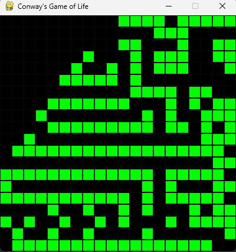

# Game of Life

<p align="center">
  
</p>

## Overview

This project is an implementation of Conway's Game of Life, a cellular automaton devised by the British mathematician John Horton Conway in 1970. The game is a zero-player game, meaning that its evolution is determined by its initial state, requiring no further input. One interacts with the Game of Life by creating an initial configuration and observing how it evolves.

## Features

- **Customizable Grid Size:** Users can define the size of the game grid to suit their preferences or constraints.
- **Initial State Setup:** Provides the ability to set up initial configurations easily, allowing for endless possibilities in the patterns that can be generated.
- **Step-by-Step Evolution:** Users can step through the evolution of the game one generation at a time to closely observe the dynamics of their configurations.
- **Automatic Evolution:** Includes an option to let the game evolve automatically, showcasing the fascinating patterns that emerge over time.

## Requirements

- [Python](https://www.python.org)
- [PyGame](https://www.pygame.org/docs/)

## Installation

To get started with the Game of Life, clone this repository to your local machine:

```bash
git clone https://github.com/Giyanellow/Game-of-Life
cd game-of-life
```
